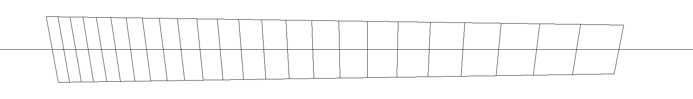
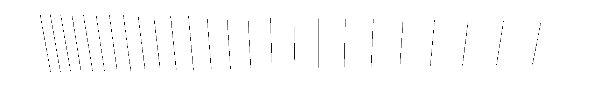
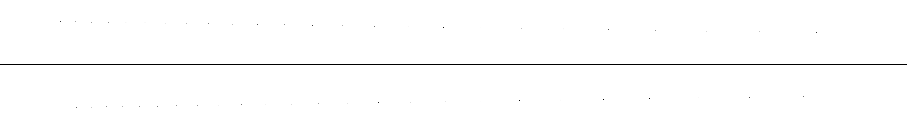

# multiscale-fretboard-template-generator

This repo contains a script for generating multiscale fret templates!

## Background

Guitars typically have strings of the same length, but they don't have to!

A string's "scale" refers to its length. Along that length, frets are (typically) positioned at a constant factor at each half-step, or one-twelfth of an octave.

A "multiscale" or "fan-fret" guitar is one where the strings have different lengths. Most commonly, the highest string is the shortest, and each lower string is incrementally longer. To accomodate this, frets are angled to cross each of these half-step positions, like spokes on a distant wheel. This has several benefits:
- Versatility: longer strings have higher tension, so the lowest string is super tight for chugging, and the highest string can still be bent (aka stretched) for solos
- Ergonomics: "fanned" frets angle along with the rotation of the fretting arm from the elbow, making notes high on the fretboard easier to reach
- Awesomeness: it looks cool, and the best guitar is the one that inspires the player to play. Ergo, awesome = best.

## What this script does

1. Calculates the distance between each fret along the highest and lowest strings
2. Offsets the high string according to which fret is configured to be "neutral", or at exactly 90 degrees
2. Draws a center line so that the template can be aligned with the fretboard, for machining or by hand
3. Exports three images: one with frets and strings, one with only frets, and one with dots at the position of each fret along the strings

## Usage

1. Copy `config.example.yml` to a new file named `config.yml`
2. Update the values for your use-case, with all measurements in millimeters
3. Run the script below and check your output folder!

```bash
python3 -m pipenv run generator
```

## Configuration options

- is-left-handed
- number of strings
- number of frets
- length of lowest string
- length of highest string
- neutral fret
- string spacing at nut 
- string spacing at bridge

## Output

The script generates three templates:

**Frets as lines, with outer strings:**


**Frets as lines, without strings:**


**String/fret intersection points:**

